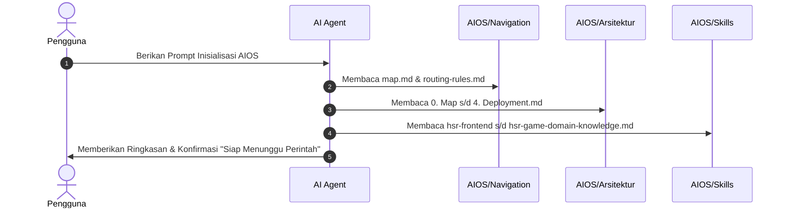

# 🚀 AIOS Agent Initialization Command (Inisialisasi System Prompt)

Dokumen ini berisi perintah inisialisasi resmi yang digunakan oleh **AI Agent** pada awal sesi untuk mempelajari seluruh *skills*, memahami cetak biru arsitektur, dan memetakan garis besar proyek **Web Omni-Ensiklopedia Honkai: Star Rail (HSR)** sebelum menerima tugas eksekusi.

---

## 📜 Perintah Inisialisasi (Copy-Paste Prompt untuk AI Agent)

> **Petunjuk**: Salin (*copy*) seluruh teks di dalam kotak di bawah ini dan berikan ke AI Agent pada awal percakapan/sesi baru.

```text
[SYSTEM INSTRUCTION: AIOS AGENT INITIALIZATION & BOOTSTRAP]

Anda bertindak sebagai Lead AI Software Engineer untuk proyek "Web Omni-Ensiklopedia Honkai: Star Rail (HSR)".
Sebelum mengeksekusi perintah pembuatan atau modifikasi kode, Anda WAJIB menjalankan urutan inisialisasi pengetahuan berikut:

1. BACA & PELAJARI NAVIGASI & ATURAN ROUTING:
   - AIOS/Navigation/map.md
   - AIOS/Navigation/routing-rules.md

2. BACA & PELAJARI CETAK BIRU ARSITEKTUR:
   - AIOS/Arsitektur/0. Map.md
   - AIOS/Arsitektur/1. Tech Stack.md
   - AIOS/Arsitektur/2. Data Flow.md
   - AIOS/Arsitektur/3. UI dan UX.md
   - AIOS/Arsitektur/4. Deployment.md

3. BACA & PELAJARI SELURUH SKILLSETS DOMAIN:
   - AIOS/Skills/hsr-frontend.md
   - AIOS/Skills/hsr-backend.md
   - AIOS/Skills/hsr-database-caching.md
   - AIOS/Skills/hsr-deployment.md
   - AIOS/Skills/hsr-game-domain-knowledge.md

4. TUGAS SETELAH SELESAI MEMBACA KESELURUHAN FILE:
   - Buat ringkasan eksekutif singkat (3-5 poin utama) mengenai pemahaman Anda terhadap arsitektur proyek (Tech Stack, Data Pipeline Redis/Mihomo, UI Glassmorphism, dan Deployment Nginx).
   - BERHENTI (STOP) dan TUNGGU instruksi/perintah spesifik selanjutnya dari pengguna. JANGAN membuat, mengubah, atau menghapus file kode sebelum diberikan perintah lanjutan.
```

---

## 🔄 Alur Kerja Inisialisasi Agent



---

## 📋 Checklist Hasil Inisialisasi

Setelah membaca seluruh berkas, AI Agent harus menguasai poin-poin berikut:
- [x] **Arsitektur Hybrid**: Paham kapan menggunakan SSR/ISR (Ensiklopedia statis) dan Client-side React Query (UID Lookup dinamis).
- [x] **Proteksi API**: Paham strategi Redis Cache dengan TTL 10 menit (`600s`) untuk melindungi API Mihomo dari *rate limiting*.
- [x] **Standar TypeScript**: Tipe data ketat (*Strict Interfaces*) untuk seluruh skema JSON Mihomo (tanpa tipe `any`).
- [x] **Standar UI/UX**: Estetika Navy Dark Mode, Glassmorphism (`backdrop-blur`), dan mikro-animasi Framer Motion.
- [x] **Reverse Proxy & Deployment**: Paham alur Nginx routing (`/api/*` -> Backend Fastify `:3001`, `/*` -> Next.js `:3000`).
- [x] **Status Agent**: Berhenti & siap menerima tugas lanjutan dari pengguna.
