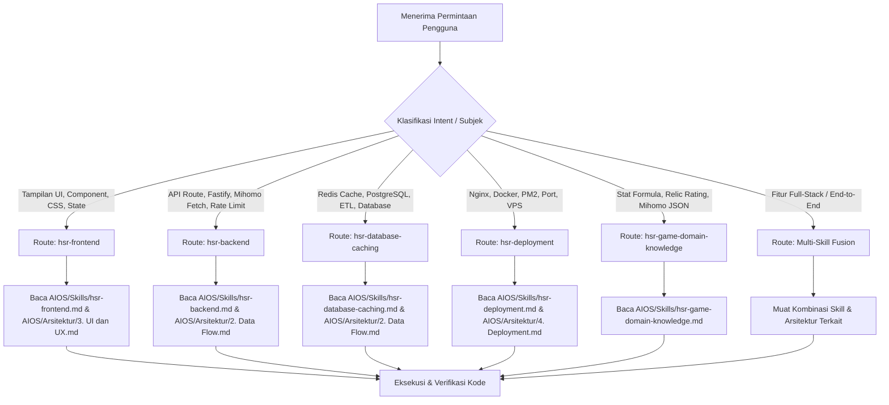

# 🚦 AI Agent Routing Rules & Decision Matrix

Dokumen ini berisi aturan logis (*Routing Rules*) dan matriks keputusan (*Decision Matrix*) untuk **AI Agent** yang bekerja di dalam ekosistem **Omni-Ensiklopedia HSR**. Aturan ini memastikan AI Agent secara otomatis memilih dan memuat konteks pengetahuan (*skills* & *arsitektur*) yang tepat sebelum melakukan analisis atau penulisan kode.

---

## 📐 1. Prinsip Utama Routing

1. **Context Efficiency (Efisiensi Konteks)**: Hanya muat berkas arsitektur dan *skill* yang relevan dengan tugas yang diminta pengguna untuk menghemat alokasi memori konteks.
2. **Strict Protocol Compliance**: Selalu patuhi standar penulisan kode dan tipe data yang tertera pada *skill* target (misalnya: tidak memperbolehkan `any` di TypeScript).
3. **Cross-Domain Fusion**: Untuk tugas yang mencakup *Full-Stack* (ujung ke ujung), AI Agent wajib menggabungkan beberapa *skill* sesuai hierarki prioritas.

---

## 🔄 2. Diagram Alur Keputusan Agent

---

## 📊 3. Matriks Keputusan Routing (Intent Routing Matrix)

| Intent / Kata Kunci Pengguna | Utama (*Primary Skill*) | Pendukung (*Secondary*) | Berkas Arsitektur Terkait |
| :--- | :--- | :--- | :--- |
| **Komponen UI, Layout, Tailwind, Animasi, Recharts, Page Route** | [hsr-frontend.md](file:///home/cynder/omni-app/AIOS/Skills/hsr-frontend.md) | [hsr-game-domain-knowledge.md](file:///home/cynder/omni-app/AIOS/Skills/hsr-game-domain-knowledge.md) | [3. UI dan UX.md](file:///home/cynder/omni-app/AIOS/Arsitektur/3.%20UI%20dan%20UX.md) |
| **API Endpoint, Proxy Mihomo, Fastify, Rate Limiting, Sanitasi Data** | [hsr-backend.md](file:///home/cynder/omni-app/AIOS/Skills/hsr-backend.md) | [hsr-database-caching.md](file:///home/cynder/omni-app/AIOS/Skills/hsr-database-caching.md) | [2. Data Flow.md](file:///home/cynder/omni-app/AIOS/Arsitektur/2.%20Data%20Flow.md) |
| **Redis Cache Hit/Miss, Key TTL, PostgreSQL Schema, Migration, ETL** | [hsr-database-caching.md](file:///home/cynder/omni-app/AIOS/Skills/hsr-database-caching.md) | [hsr-backend.md](file:///home/cynder/omni-app/AIOS/Skills/hsr-backend.md) | [2. Data Flow.md](file:///home/cynder/omni-app/AIOS/Arsitektur/2.%20Data%20Flow.md) |
| **Nginx Proxy Pass, Dockerfile, Docker Compose, PM2, Port 3000/3001** | [hsr-deployment.md](file:///home/cynder/omni-app/AIOS/Skills/hsr-deployment.md) | [hsr-backend.md](file:///home/cynder/omni-app/AIOS/Skills/hsr-backend.md) | [4. Deployment.md](file:///home/cynder/omni-app/AIOS/Arsitektur/4.%20Deployment.md) |
| **Kalkulasi Damage, Stat Character, Parsing Mihomo JSON, Rarity, Substat** | [hsr-game-domain-knowledge.md](file:///home/cynder/omni-app/AIOS/Skills/hsr-game-domain-knowledge.md) | [hsr-frontend.md](file:///home/cynder/omni-app/AIOS/Skills/hsr-frontend.md) | [0. Map.md](file:///home/cynder/omni-app/AIOS/Arsitektur/0.%20Map.md) |
| **Pencarian UID / Profile Showcase (Full-Stack Feature)** | Multi-Skill Fusion (Frontend + Backend + DB + Game Knowledge) | - | Semua File Arsitektur |

---

## ⚡ 4. Aturan Spesifik Berdasarkan Domain

### A. Domain Frontend
- **Trigger**: Pengguna meminta membuat atau mengubah komponen UI, halaman Next.js, animasi, atau style.
- **Rute Wajib**:
  1. Baca [hsr-frontend.md](file:///home/cynder/omni-app/AIOS/Skills/hsr-frontend.md).
  2. Rujuk [3. UI dan UX.md](file:///home/cynder/omni-app/AIOS/Arsitektur/3.%20UI%20dan%20UX.md) untuk spesifikasi visual (Navy Dark Theme, Glassmorphism, Framer Motion).
- **Aturan Eksekusi**:
  - Semua *interface* data Mihomo wajib dibuat ketat (Strict TypeScript Types, *no `any`*).
  - Posisikan rute ensiklopedia di Server Components, sedangkan pencarian UID menggunakan Client Components + TanStack Query.
  - `staleTime` pada TanStack Query wajib disinkronkan dengan Redis TTL (10 menit).

### B. Domain Backend & API
- **Trigger**: Pengguna meminta membuat endpoint API baru, mengintegrasikan Mihomo API, atau proteksi server.
- **Rute Wajib**:
  1. Baca [hsr-backend.md](file:///home/cynder/omni-app/AIOS/Skills/hsr-backend.md).
  2. Rujuk [2. Data Flow.md](file:///home/cynder/omni-app/AIOS/Arsitektur/2.%20Data%20Flow.md).
- **Aturan Eksekusi**:
  - Terapkan Rate Limiting internal sebelum meneruskan *request* ke API Mihomo.
  - Alur wajib: Cek Redis -> Jika Hit, return langsung -> Jika Miss, fetch Mihomo -> Sanitasi -> Simpan ke Redis (TTL 600s) -> Return.

### C. Domain Database & Caching
- **Trigger**: Pengguna meminta optimasi cache Redis, skema PostgreSQL, atau script ETL.
- **Rute Wajib**:
  1. Baca [hsr-database-caching.md](file:///home/cynder/omni-app/AIOS/Skills/hsr-database-caching.md).
  2. Rujuk [2. Data Flow.md](file:///home/cynder/omni-app/AIOS/Arsitektur/2.%20Data%20Flow.md).
- **Aturan Eksekusi**:
  - Format Key Redis wajib seragam: `hsr:user:<uid>` atau `hsr:character:<id>`.
  - Durasi TTL Redis standar adalah 600 detik (10 menit).

### D. Domain Deployment & Infrastruktur
- **Trigger**: Pengguna meminta setup Docker, Nginx, PM2, SSL, atau persiapan server VPS.
- **Rute Wajib**:
  1. Baca [hsr-deployment.md](file:///home/cynder/omni-app/AIOS/Skills/hsr-deployment.md).
  2. Rujuk [4. Deployment.md](file:///home/cynder/omni-app/AIOS/Arsitektur/4.%20Deployment.md).
- **Aturan Eksekusi**:
  - Nginx bertindak sebagai Reverse Proxy di port 80/443.
  - `/api/*` di-proxy ke Backend (port 3001), `/*` di-proxy ke Frontend Next.js (port 3000).
  - Aktifkan kompresi Gzip/Brotli pada Nginx.

### E. Domain Game Knowledge HSR
- **Trigger**: Pengguna menanyakan struktur data karakter HSR, stat formula, kalkulasi relic, atau JSON schema Mihomo.
- **Rute Wajib**:
  1. Baca [hsr-game-domain-knowledge.md](file:///home/cynder/omni-app/AIOS/Skills/hsr-game-domain-knowledge.md).
- **Aturan Eksekusi**:
  - Gunakan pemetaan stat resmi (HP, ATK, DEF, SPD, CRIT Rate, CRIT DMG, Break Effect, dll).
  - Pastikan konversi nilai persentase pada Substat Relic ditangani dengan benar.

---

## 🏆 5. Hierarki Prioritas Resolusi Konteks

Jika terjadi konflik atau ketidakjelasan instruksi, AI Agent wajib menyelesaikan urutan prioritas sebagai berikut:

1. **Aturan Routing Agent**: [AIOS/Navigation/routing-rules.md](file:///home/cynder/omni-app/AIOS/Navigation/routing-rules.md)
2. **Skill Spesifik Domain**: Berkas dalam `AIOS/Skills/`
3. **Cetak Biru Arsitektur**: Berkas dalam `AIOS/Arsitektur/`
4. **Kode Sumber Aktif**: Implementasi aktual dalam repositori (`src/`, `components/`, `lib/`, dll)

---

## 📝 6. Pembaruan Sistem Navigation & Routing

Apabila terdapat penambahan modul, perubahan arsitektur, atau penambahan *skill* baru di kemudian hari:
1. Perbarui daftar berkas pada **[map.md](file:///home/cynder/omni-app/AIOS/Navigation/map.md)**.
2. Tambahkan entri baru pada **Matriks Keputusan Routing** di dokumen ini.
